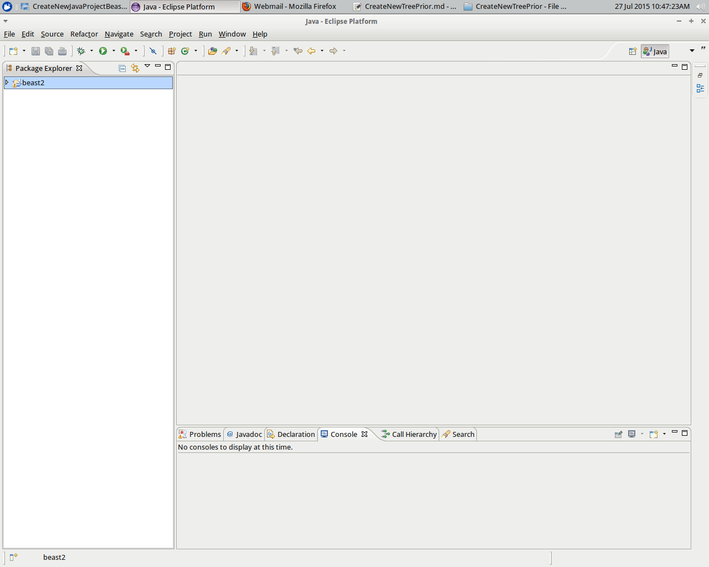
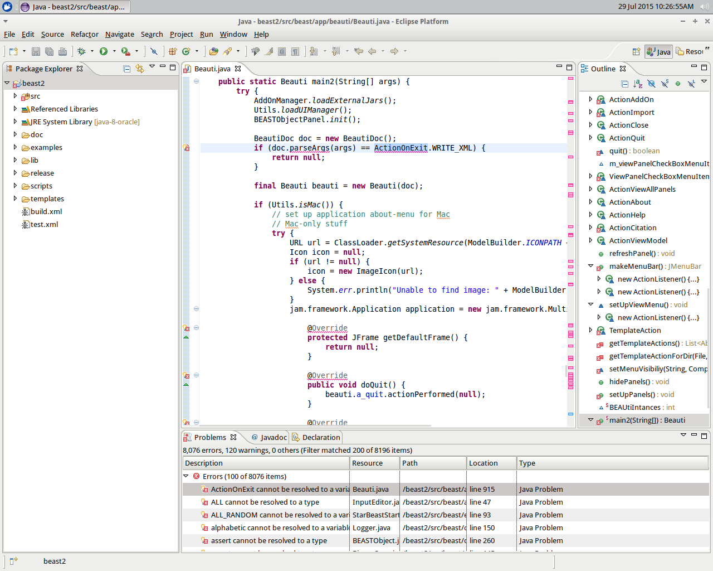
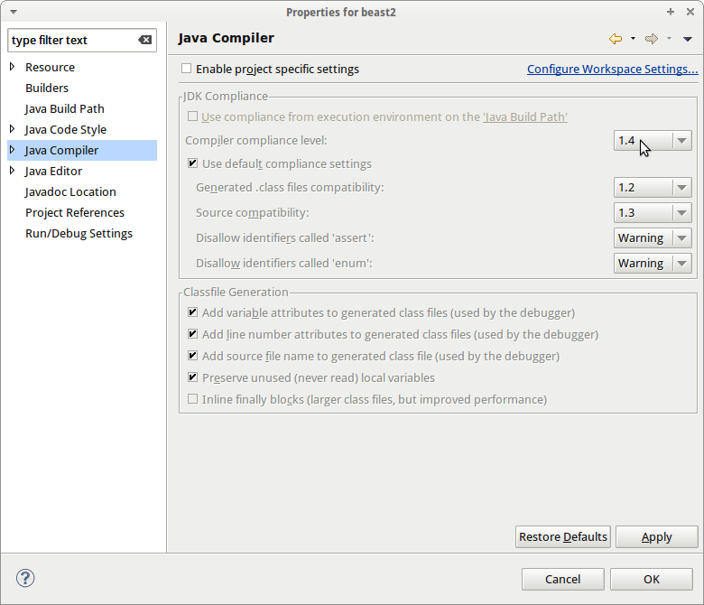
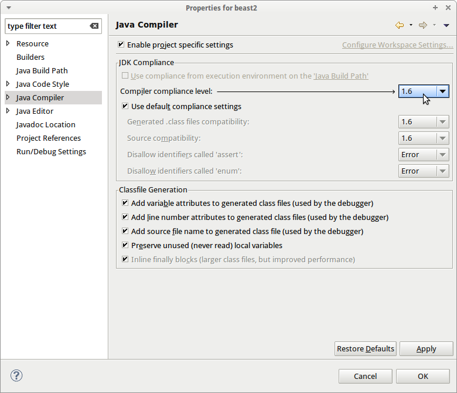
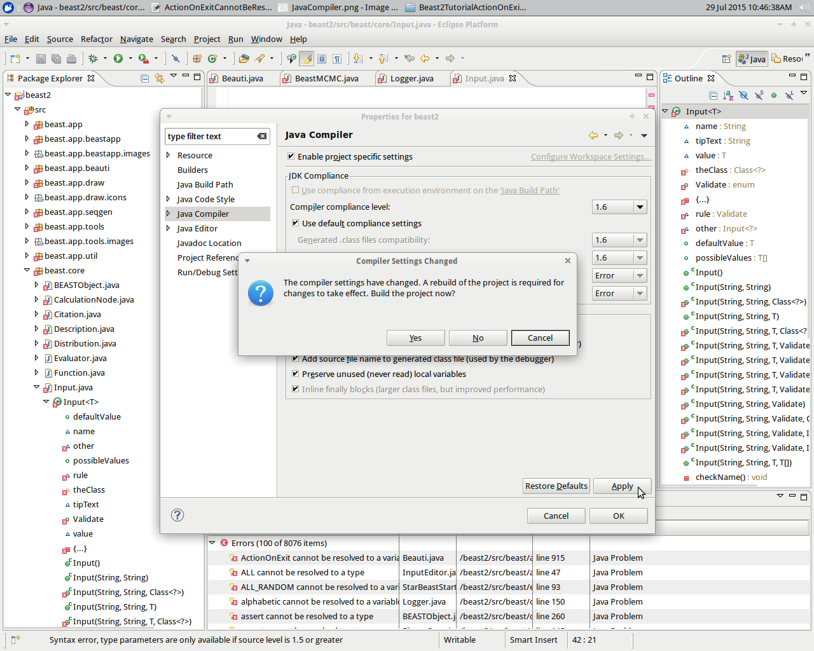
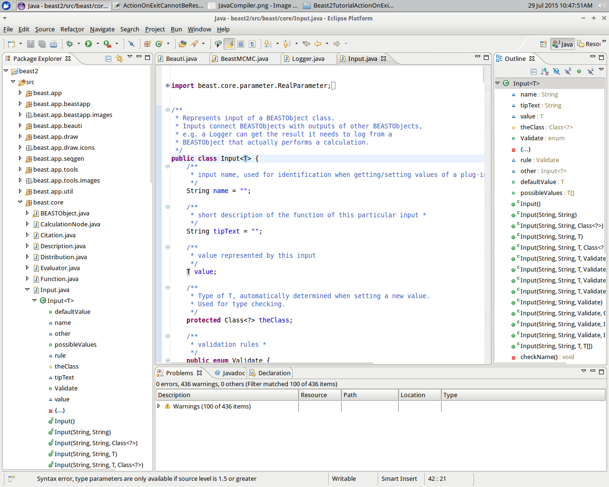
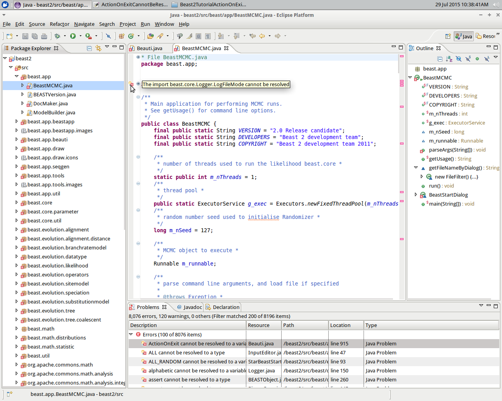
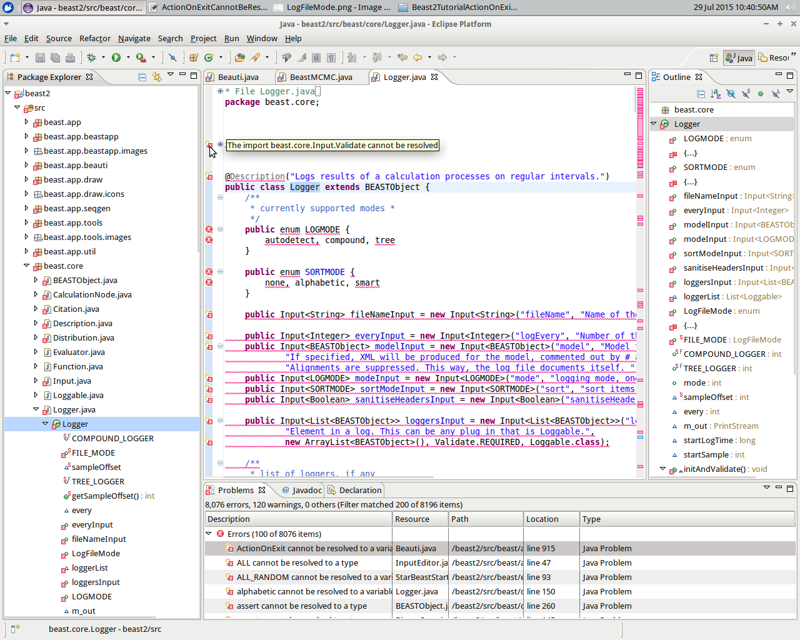
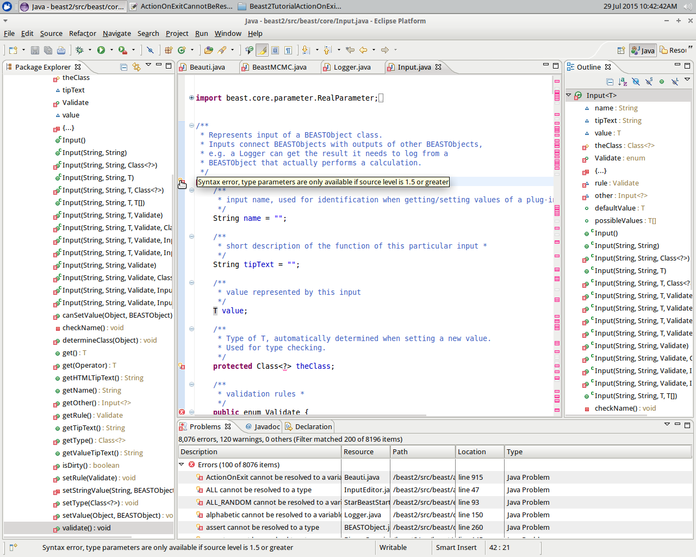

# Errors after putting BEAST2 into a Java project

[This tutorial](../CreateNewTreePrior/CreateNewTreePrior.md), section `Put BEAST2 into a Java project` shows how to put
BEAST2 into a Java project. This does not always work out well.

Ideally, you'd see this:

This tutorial shows how to deal with this:

 * If you just want to fix the error, go to the `Fix the error` section. 
 * If you are interested in how to find out the problem, visit the `How to find out` section

## Fix the error

Do `Project | Properties`, then `Java compiler`.

Set it to 1.6:

Click `Apply`. The project will request a rebuild, click `Yes`.

Click `Apply` again. All errors are gone now.

## How to find out

We zoom in on the first error: `beast.core.Logger.LogFileMode` cannot be resolved.

We visit the first error in `beast.core.Logger.LogFileMode`. Here we see `beast.core.Input.Validate` cannot be resolved.

We visit the first error in `beast.core.Input.Validate`. Here we see there is a syntax error and that we need JRE 1.5 or higher.

