# How to add a tree prior to BEAST2?

This tutorial follows the same wording and structure as [BEAST2: how to write a BEAST2 package](http://beast2.org/writing-a-beast-2-package), but for a tree prior instead.

## Empty Package Explorer

When starting Eclipse in a new workspace, the Package Explorer is still empty. In this example, my workspace is `~/GitHubs/Java`.

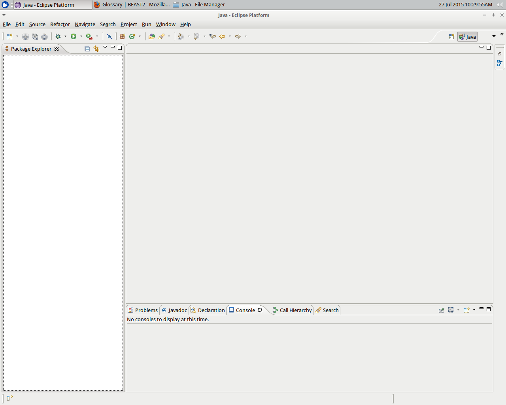

## Adding BEAST2 to the Package Explorer

To add BEAST2 to the Package Explorer, it must first be downloaded, then put into a Java project.

### Download BEAST2

In this example, I download BEAST2 from the SVN repository from withing the `~/GitHubs/Java' folder:

`
cd ~/GitHubs/Java
svn checkout http://beast2.googlecode.com/svn/trunk/ beast2
`
This will create a folder called `beast2`.

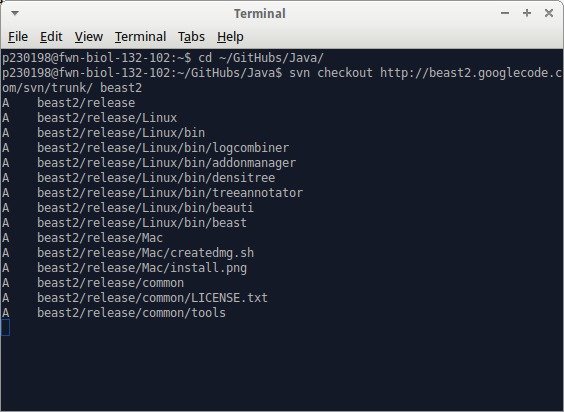

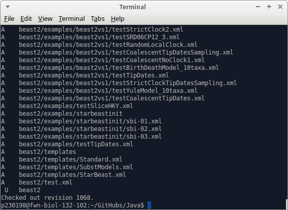


### Put BEAST2 into a Java project

First, we will add `beast2` to the Package Explorer.

Select `File | New | Java Project`:


This is how the 'Create a Java Project dialog` looks like:


Just type in the word `beast`. It will detect there is a folder called `beast2` and the dialog will change:


Just press `Finish`.

Now, the Eclipse Package Explorer shows the project `beast2`. Well done!

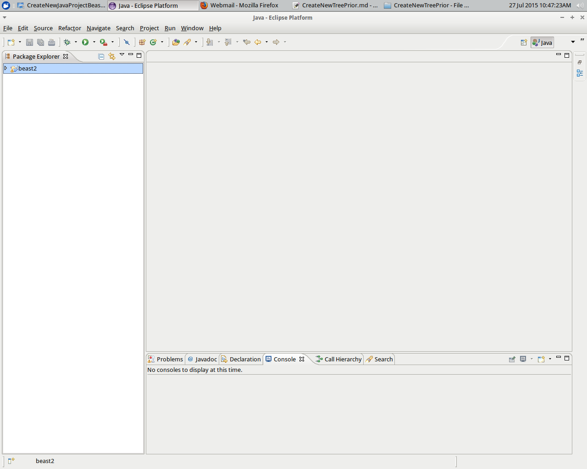

## Creating your own project

Now you need to create an Eclipse project for your package and make it depend on the `beast2` project.

Select `File | New | Java Project`:


In `Project name`, type in the name, for example `MyProject`. For the JRE, be sure `JavaSE-1.6` or something higher is checked. Click Finish.


Now you should see two projects in the Package Explorer pane: `beast2` and `MyProject`.


## Add BEAST2 to your own project

Right-click `MyProject` and choose `Properties` from the pop-up menu that appears


Go to `Java build path | Projects` and click `Add`.


Add `beast2` to your project build path:


Now BEAST2 is in your project build path, click `OK`.

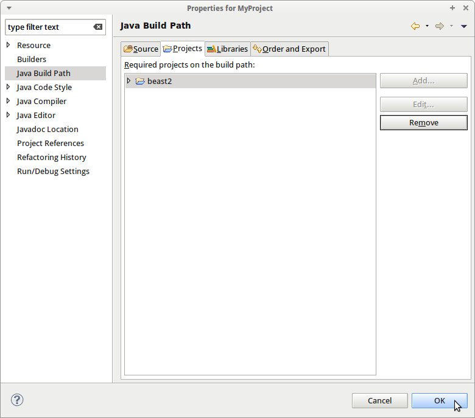

This takes you back to the Package Explorer pane.


## Create a new tree prior

To create a new tree prior, I will use the Yule model already present in BEAST2.

Select `MyProject` in the Package Explorer, right-click and select 'New | Class'


Change the class name to `MyTreePrior`. Ignore all the warnings (as we won't use the generated code anyways) and click `Finish`. 


Now you will see the initial code of `MyTreePrior`:


This initial code, however, will be replaced soon.

I will replace the initial code by the Yule tree prior. In the Package Explorer, find the Yule tree prior code. It is under `beast2 | src | beast.evolution.speciation`.

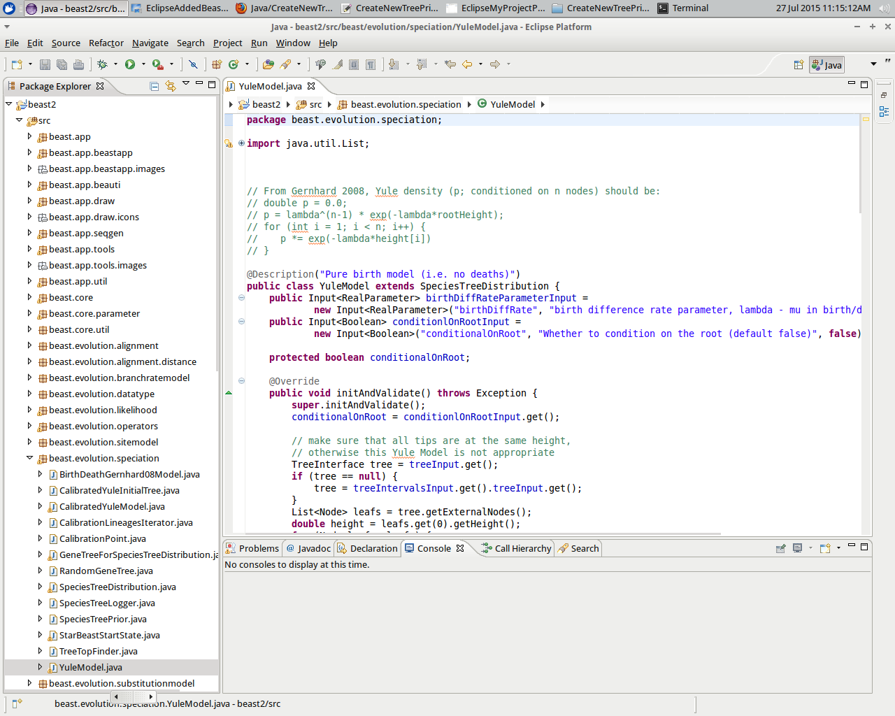

Copy-paste the source code into the `MyTreePrior` code. A lot of errors pop up that we'll fix now.

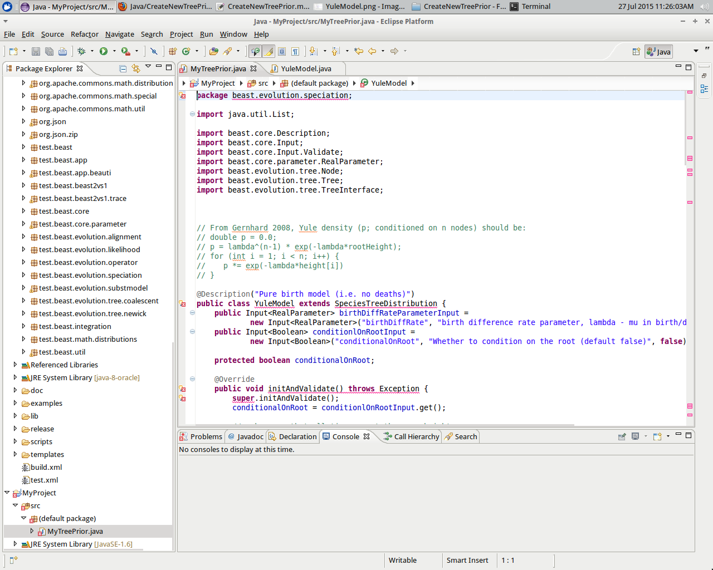

The first error suggests to put the class in the appropriate package.


Double-click this fix.

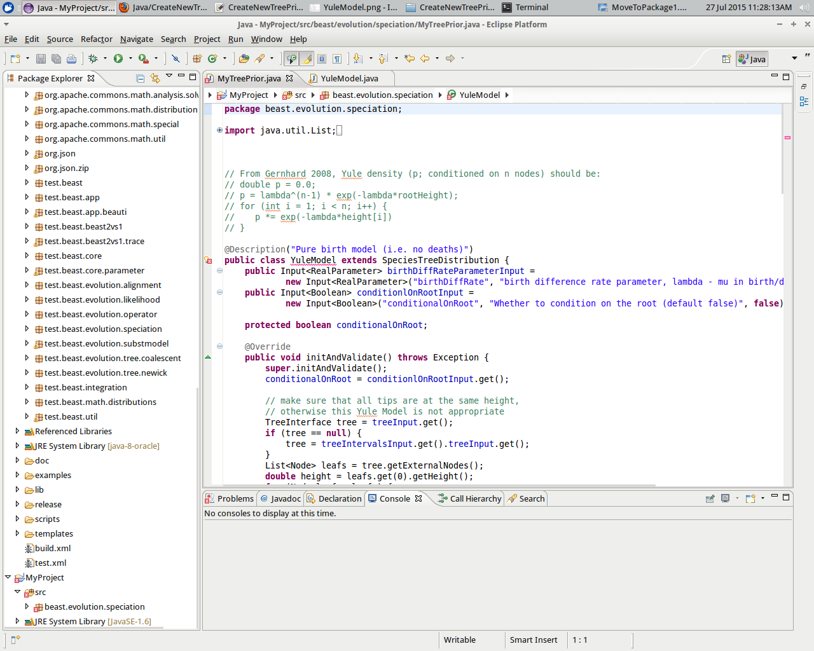

The next error is that `YuleModel` is not the correct type and Eclipse suggest to rename it to `MyTreePrior` instead.

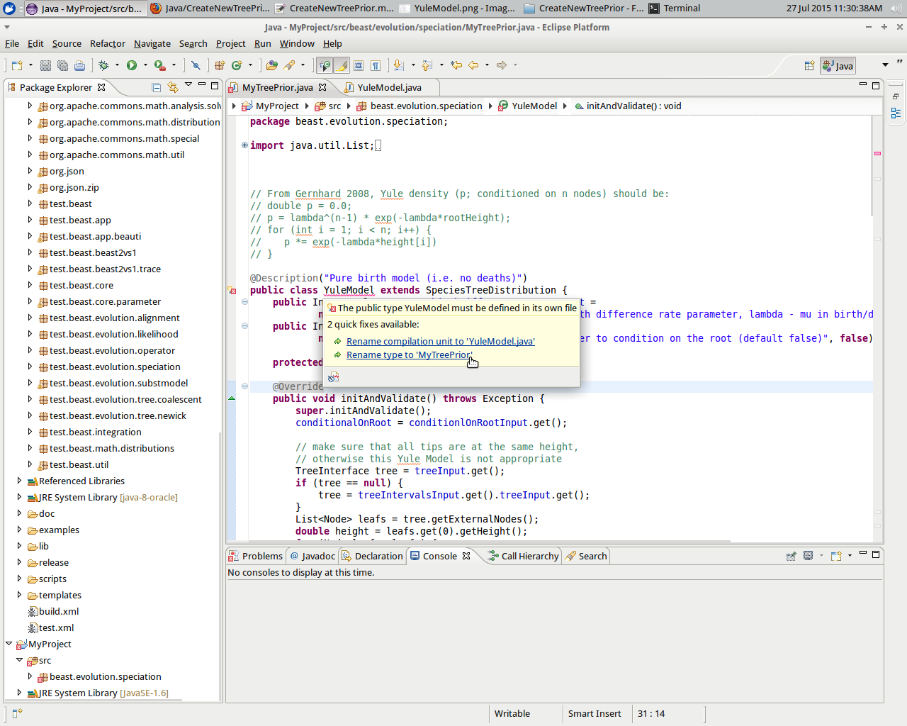

Double-click this fix. Our class now has the correct (new) class name.


## Add the tree prior to BEAUti 

To allow BEAUti to find the new tree prior, a template XML files needs to be created. Because `MyTreePrior`
is a copy of `YuleModel`, we will use the XML code of that model as a starting point.

In the `MyProject` folder, you will need to create a `templates` folder. 
I just copied `~/GitHubs/Java/beast2/templates` to `~/GitHubs/Java/MyProject/templates`.

In that folder, only keep `SubstModels.xml` and rename it to `MyTreePrior.xml`. 
Then edit `MyTreePrior.xml`. You can find `YuleModel` somewhere in that file. It will be the only one to keep.

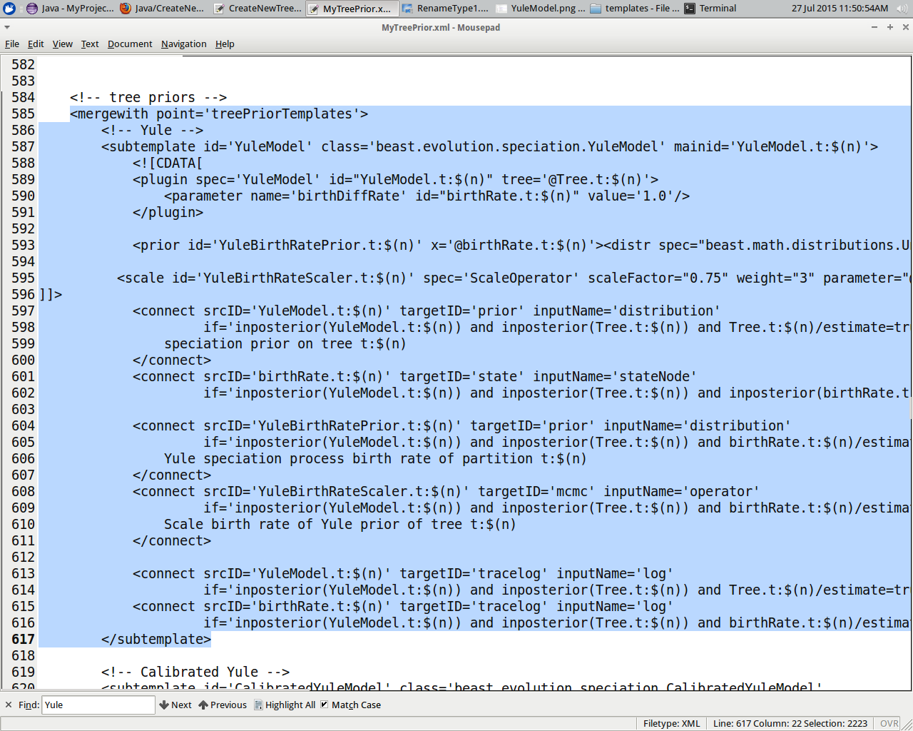

Remove all other things, except for `YuleModel`. Be sure to keep the closing XML tags. Or just copy paste this code:

```
<beast version='2.0'
       namespace='beast.app.beauti:beast.core:beast.evolution.branchratemodel:beast.evolution.speciation:beast.evolution.tree.coalescent:beast.core.util:beast.evolution.nuc:beast.evolution.operators:beast.evolution.sitemodel:beast.evolution.substitutionmodel:beast.evolution.likelihood:beast.evolution:beast.math.distributions'>

    <!-- tree priors -->
    <mergewith point='treePriorTemplates'>
        <!-- Yule -->
        <subtemplate id='YuleModel' class='beast.evolution.speciation.YuleModel' mainid='YuleModel.t:$(n)'>
            <![CDATA[
            <plugin spec='YuleModel' id="YuleModel.t:$(n)" tree='@Tree.t:$(n)'>
                <parameter name='birthDiffRate' id="birthRate.t:$(n)" value='1.0'/>
            </plugin>

            <prior id='YuleBirthRatePrior.t:$(n)' x='@birthRate.t:$(n)'><distr spec="beast.math.distributions.Uniform" lower='0' upper='1000'/></prior>

  		    <scale id='YuleBirthRateScaler.t:$(n)' spec='ScaleOperator' scaleFactor="0.75" weight="3" parameter="@birthRate.t:$(n)"/>
]]>
            <connect srcID='YuleModel.t:$(n)' targetID='prior' inputName='distribution'
                     if='inposterior(YuleModel.t:$(n)) and inposterior(Tree.t:$(n)) and Tree.t:$(n)/estimate=true'>Yule
                speciation prior on tree t:$(n)
            </connect>
            <connect srcID='birthRate.t:$(n)' targetID='state' inputName='stateNode'
                     if='inposterior(YuleModel.t:$(n)) and inposterior(Tree.t:$(n)) and inposterior(birthRate.t:$(n)) and birthRate.t:$(n)/estimate=true'/>

            <connect srcID='YuleBirthRatePrior.t:$(n)' targetID='prior' inputName='distribution'
                     if='inposterior(YuleModel.t:$(n)) and inposterior(Tree.t:$(n)) and birthRate.t:$(n)/estimate=true'>
                Yule speciation process birth rate of partition t:$(n)
            </connect>
            <connect srcID='YuleBirthRateScaler.t:$(n)' targetID='mcmc' inputName='operator'
                     if='inposterior(YuleModel.t:$(n)) and inposterior(Tree.t:$(n)) and birthRate.t:$(n)/estimate=true'>
                Scale birth rate of Yule prior of tree t:$(n)
            </connect>

            <connect srcID='YuleModel.t:$(n)' targetID='tracelog' inputName='log'
                     if='inposterior(YuleModel.t:$(n)) and inposterior(Tree.t:$(n)) and Tree.t:$(n)/estimate=true'/>
            <connect srcID='birthRate.t:$(n)' targetID='tracelog' inputName='log'
                     if='inposterior(YuleModel.t:$(n)) and inposterior(Tree.t:$(n)) and birthRate.t:$(n)/estimate=true'/>
        </subtemplate>

    </mergewith>

</beast>

```

Some `YuleModel` occurrances must be replaced by `MyTreePrior`. 

```
<beast version='2.0'
       namespace='beast.app.beauti:beast.core:beast.evolution.branchratemodel:beast.evolution.speciation:beast.evolution.tree.coalescent:beast.core.util:beast.evolution.nuc:beast.evolution.operators:beast.evolution.sitemodel:beast.evolution.substitutionmodel:beast.evolution.likelihood:beast.evolution:beast.math.distributions'>

    <!-- tree priors -->
    <mergewith point='treePriorTemplates'>
        <!-- Yule -->
        <subtemplate id='MyTreePrior' class='beast.evolution.speciation.MyTreePrior' mainid='MyTreePrior.t:$(n)'>
            <![CDATA[
            <plugin spec='MyTreePrior' id="MyTreePrior.t:$(n)" tree='@Tree.t:$(n)'>
                <parameter name='birthDiffRate' id="birthRate.t:$(n)" value='1.0'/>
            </plugin>

            <prior id='YuleBirthRatePrior.t:$(n)' x='@birthRate.t:$(n)'><distr spec="beast.math.distributions.Uniform" lower='0' upper='1000'/></prior>

  		    <scale id='YuleBirthRateScaler.t:$(n)' spec='ScaleOperator' scaleFactor="0.75" weight="3" parameter="@birthRate.t:$(n)"/>
]]>
            <connect srcID='MyTreePrior.t:$(n)' targetID='prior' inputName='distribution'
                     if='inposterior(MyTreePrior.t:$(n)) and inposterior(Tree.t:$(n)) and Tree.t:$(n)/estimate=true'>My speciation prior on tree t:$(n)
            </connect>
            <connect srcID='birthRate.t:$(n)' targetID='state' inputName='stateNode'
                     if='inposterior(MyTreePrior.t:$(n)) and inposterior(Tree.t:$(n)) and inposterior(birthRate.t:$(n)) and birthRate.t:$(n)/estimate=true'/>

            <connect srcID='YuleBirthRatePrior.t:$(n)' targetID='prior' inputName='distribution'
                     if='inposterior(MyTreePrior.t:$(n)) and inposterior(Tree.t:$(n)) and birthRate.t:$(n)/estimate=true'>
                Yule speciation process birth rate of partition t:$(n)
            </connect>
            <connect srcID='YuleBirthRateScaler.t:$(n)' targetID='mcmc' inputName='operator'
                     if='inposterior(MyTreePrior.t:$(n)) and inposterior(Tree.t:$(n)) and birthRate.t:$(n)/estimate=true'>
                Scale birth rate of Yule prior of tree t:$(n)
            </connect>

            <connect srcID='MyTreePrior.t:$(n)' targetID='tracelog' inputName='log'
                     if='inposterior(MyTreePrior.t:$(n)) and inposterior(Tree.t:$(n)) and Tree.t:$(n)/estimate=true'/>
            <connect srcID='birthRate.t:$(n)' targetID='tracelog' inputName='log'
                     if='inposterior(MyTreePrior.t:$(n)) and inposterior(Tree.t:$(n)) and birthRate.t:$(n)/estimate=true'/>
        </subtemplate>

    </mergewith>

</beast>
```

## Run BEAUti

To create a debug configuration that runs BEAUti, choose `Run | Debug Configurations`.


In the Debug Configurations dialog, select `Java Application`, right-click, then click `New`. 

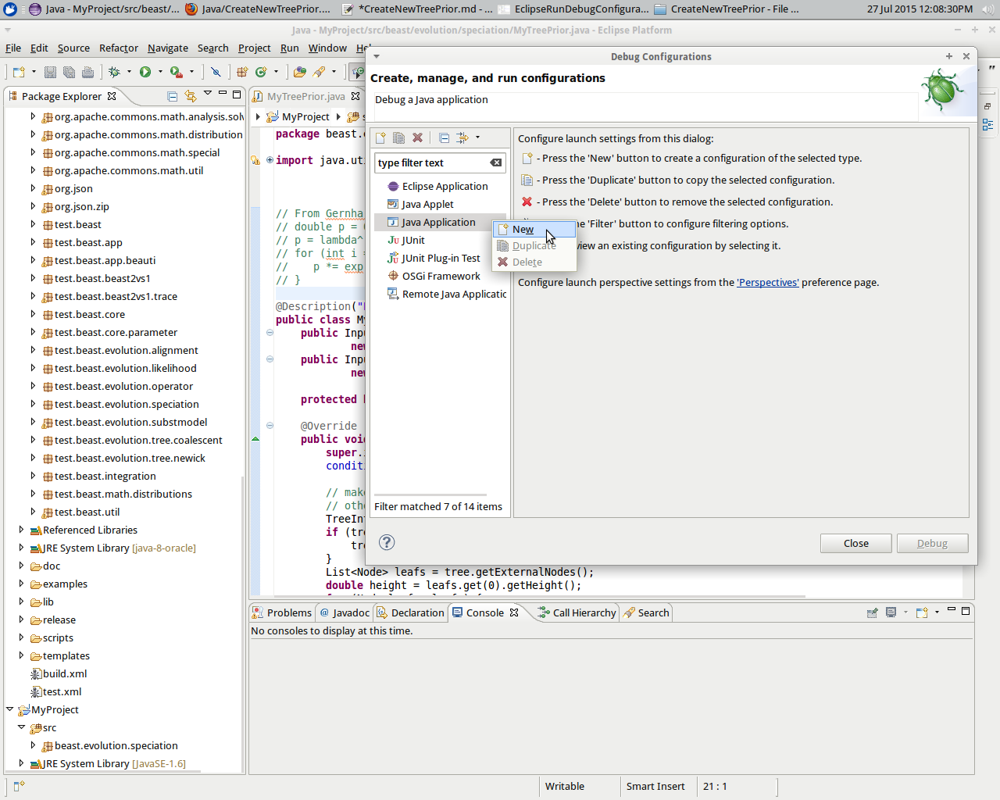

 * In the `Name` field at the top of the dialog box, type `BEAUti`
 * In the Project field of the Main tab, type `MyProject`
 * For the Main class, type `beast.app.beauti.Beauti`

Click `Apply`.

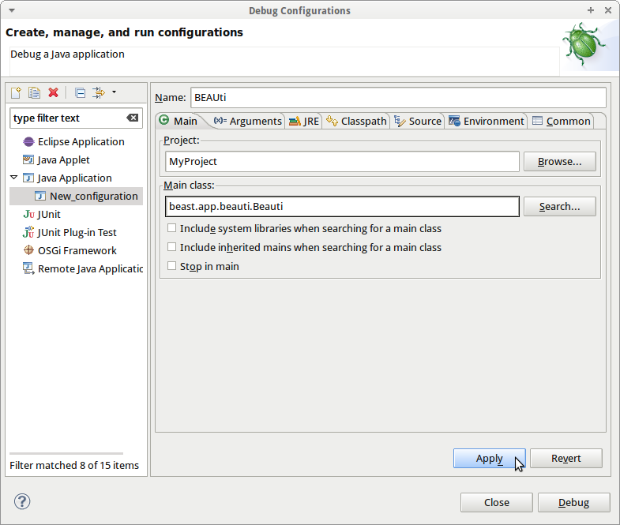

Click `Debug` to start BEAUti.

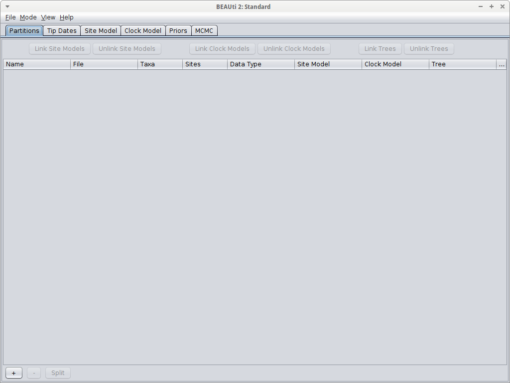

Use `File | Import Alignment` or click the `+` button at the lower left, 
then navigate to the `~/GitHubs/Java/beast2/examples/nexus` folder and select the `anolis.nex` file. 
Note: you can avoid doing this step if you 
specify `-nex ../beast2/examples/nexus/anolis.nex` 
in the `Program arguments` field of the `Arguments` tab in the BEAUti debug configuration.

Now the alignment is used in BEAUti.

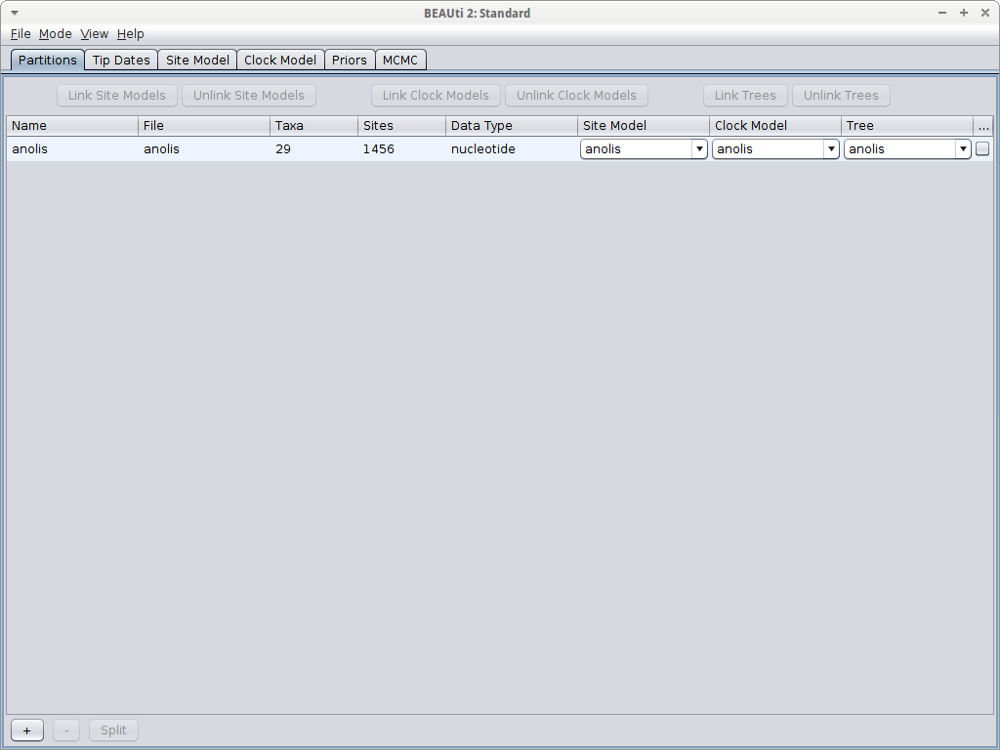

Under the tab `Priors` you can select the `My Tree Prior`.


And there it is!

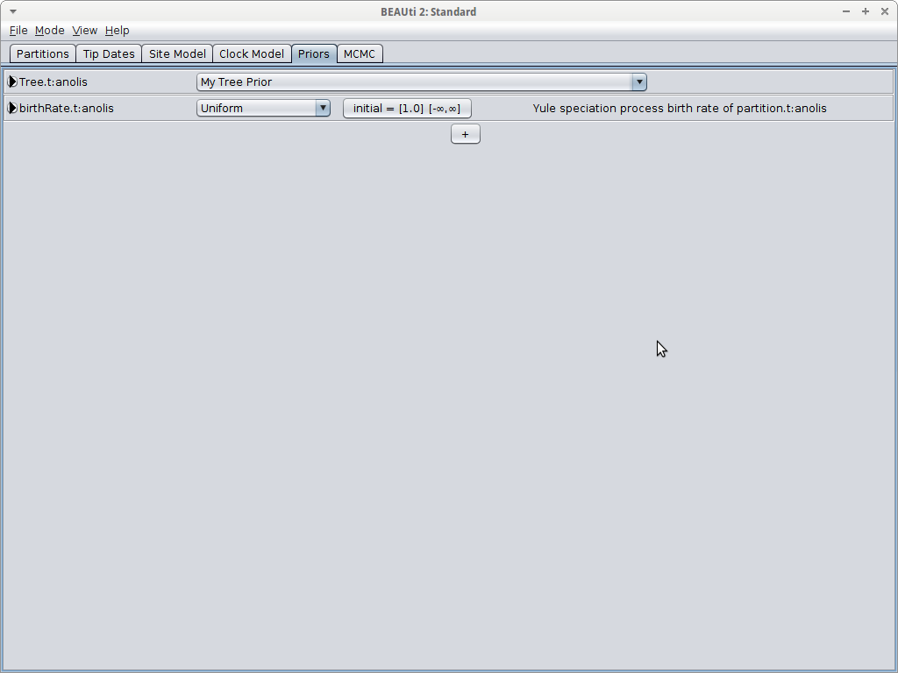